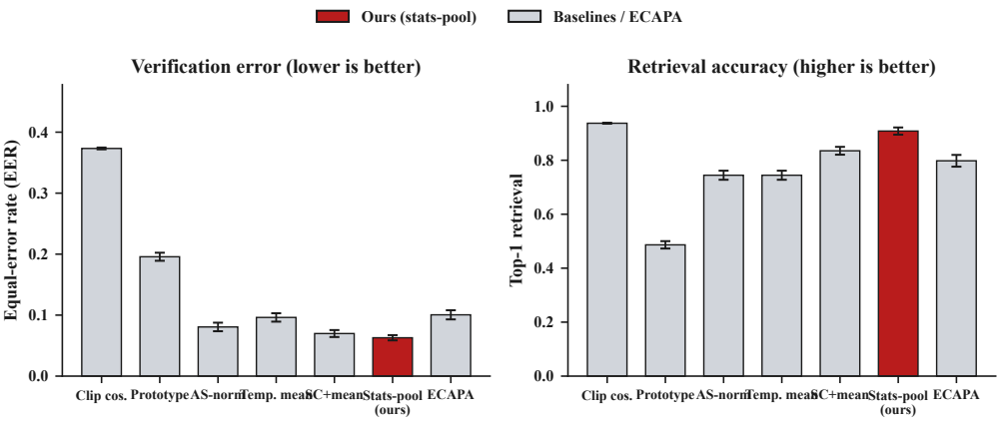
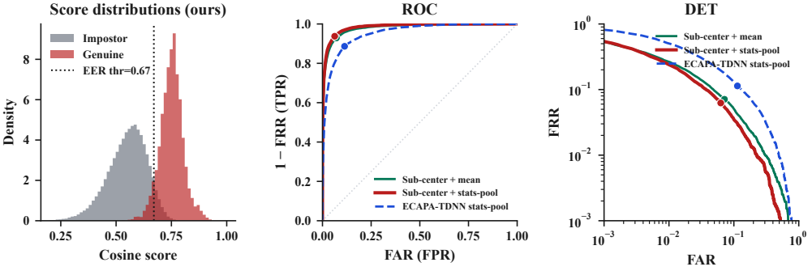
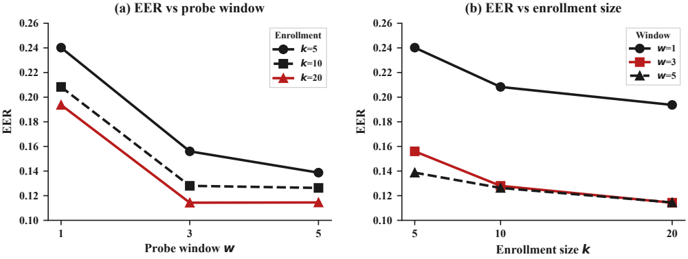
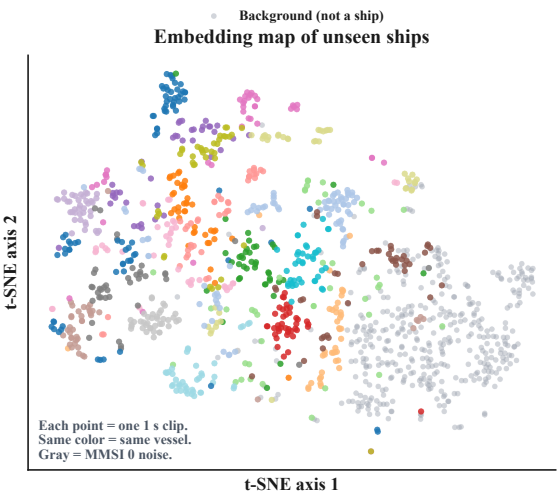
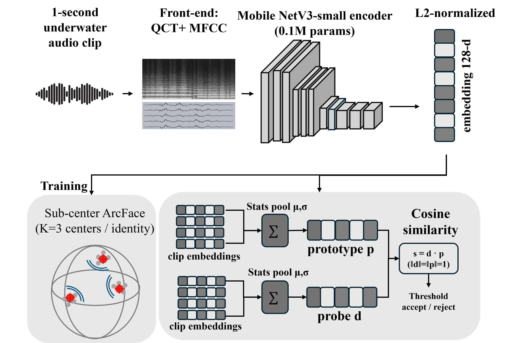
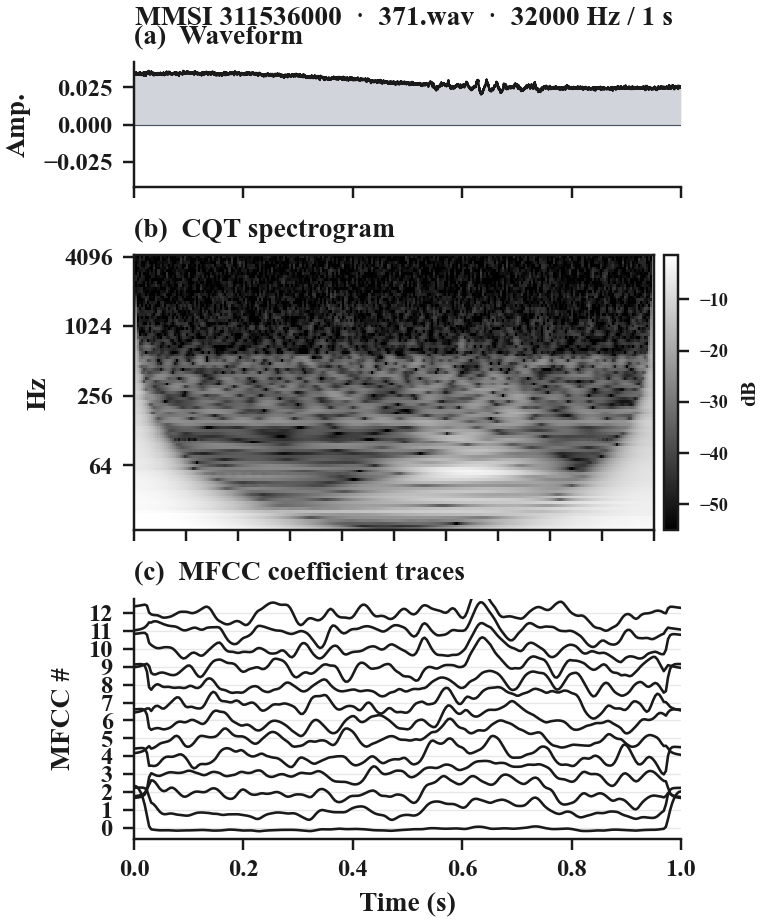
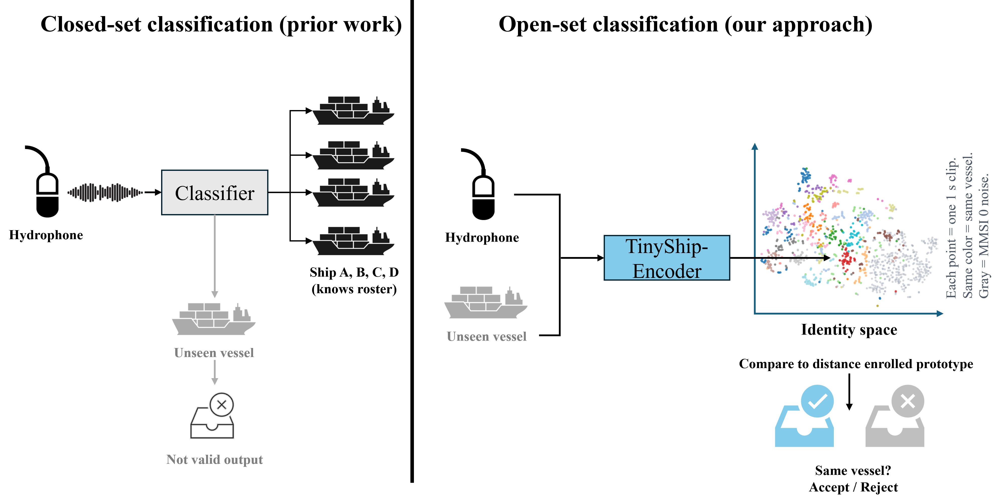
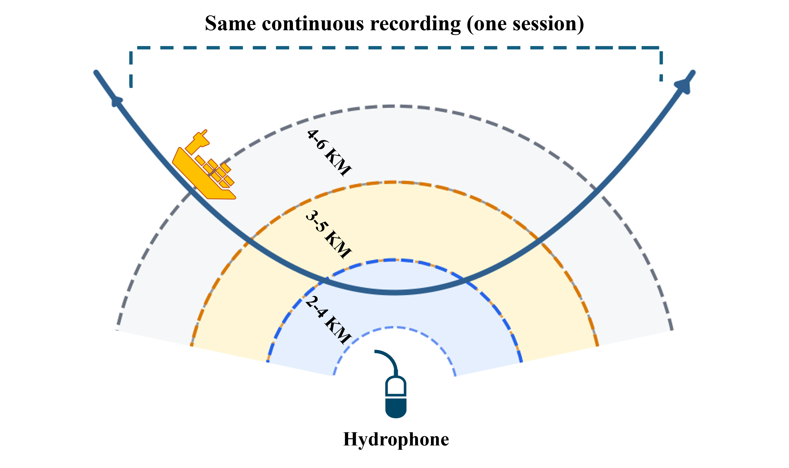

# TinyShip-Fingerprint

Compact **open-set individual vessel identification** from underwater radiated noise.

A deployed hydrophone mostly hears ships that were never in its training roster. Closed-set classifiers have no output for them. TinyShip-Fingerprint learns a 128-d acoustic embedding so any vessel can be **enrolled from a few clips** and later **verified or rejected** by cosine similarity.

| | |
|---|---|
| Encoder | MobileNetV3-Small 0.25-width, **0.099 M** parameters |
| Front-end | 1 s / 32 kHz clip → CQT (95 bins, 18–4186 Hz) + 13 MFCCs |
| Training | Sub-center ArcFace (`K=3`, `m=0.2`, `s=16`) on 178 vessels |
| Scoring | Statistics-pooled prototypes (`k=20` enroll, `w=3` probe) |
| Open-set test | **22 MMSI-disjoint** vessels never seen in training |

**Headline result** (locked protocol, mean±std over eval seeds `{0,1,2,3,4}`):

- **EER 0.063 ± 0.004** (95% MMSI-bootstrap CI `[0.035, 0.086]`)
- **top-1 0.908 ± 0.013** (CI `[0.858, 0.985]`)
- Beats a **6.19 M** ECAPA-TDNN baseline (EER 0.100 ± 0.008) at ~**63×** fewer parameters

Audio **datasets are not included** in this repository (license / size). See [Datasets](#datasets).

---

## Results

### Method comparison (22 unseen vessels)

Locked set protocol: `k=20`, `w=3`, certified clip-disjoint enroll/probe. Point estimates are mean±std over seeds `{0,1,2,3,4}`. Source: [`reports/table1_multiseed.json`](reports/table1_multiseed.json).

| Method | Front-end | EER ↓ | top-1 ↑ | Params ↓ |
|---|---|---:|---:|---:|
| ArcFace + clip cosine | CQT+MFCC 32 kHz | 0.373 ± 0.002 | 0.937 ± 0.002 | 0.099 M |
| ArcFace + prototype (`k=20`, `w=1`) | CQT+MFCC 32 kHz | 0.196 ± 0.007 | 0.486 ± 0.014 | 0.099 M |
| ArcFace + AS-norm | CQT+MFCC 32 kHz | 0.081 ± 0.007 | 0.744 ± 0.017 | 0.099 M |
| ArcFace + temporal mean | CQT+MFCC 32 kHz | 0.096 ± 0.007 | 0.744 ± 0.017 | 0.099 M |
| Sub-center + attention | CQT+MFCC 32 kHz | 0.074 ± 0.005 | 0.825 ± 0.012 | 0.099 M |
| Triplet + temporal mean | CQT+MFCC 32 kHz | 0.488 ± 0.007 | 0.083 ± 0.015 | 0.099 M |
| Sub-center + mean | CQT+MFCC 32 kHz | 0.070 ± 0.006 | 0.835 ± 0.014 | 0.099 M |
| **Sub-center + stats-pool (ours)** | CQT+MFCC 32 kHz | **0.063 ± 0.004** | **0.908 ± 0.013** | **0.099 M** |
| ECAPA-TDNN (AAM) stats-pool | fbank 16 kHz | 0.100 ± 0.008 | 0.798 ± 0.022 | 6.19 M |



Clip-level ArcFace retrieves well but verifies poorly. Statistics pooling calibrates genuine/impostor scores for accept/reject — the operating point that matters for open-set verification.

### Verification curves (seed 0)

Genuine vs impostor cosine densities, ROC, and DET. Source: [`reports/verification_curves.json`](reports/verification_curves.json).



FAR/FRR at seed 0 (`k=20`, `w=3`). Columns `@FAR` are FRR at that false-accept rate.

| Method | EER ↓ | @0.01 ↓ | @0.05 ↓ | @0.10 ↓ |
|---|---:|---:|---:|---:|
| Mean pool | 0.071 | 0.265 | 0.097 | 0.051 |
| **Stats-pool** | **0.063** | **0.240** | **0.078** | **0.035** |
| ECAPA | 0.114 | 0.503 | 0.229 | 0.130 |

### Enrollment × probe window

Test-time EER on frozen ArcFace embeddings (mean prototypes, seed 0). Source: [`reports/free_experiments_arcface.json`](reports/free_experiments_arcface.json).

|  | `w=1` | `w=3` | `w=5` |
|---|---:|---:|---:|
| `k=5` | 0.240 | 0.156 | 0.139 |
| `k=10` | 0.208 | 0.128 | 0.126 |
| `k=20` | 0.194 | 0.114 | 0.115 |



Temporal pooling is the dominant lever: at `k=5`, widening `w` from 1 to 5 cuts EER from 0.24 to 0.14.

### Open-set rejection (OSCR)

Known and unknown probes both use `w=3` set pooling against `k=20` enrollments. Unknowns: 1297 windows from 3891 background clips. Source: [`reports/e3_oscr.json`](reports/e3_oscr.json).

| Method | CCR@FPR 0.1 ↑ | OSCR-AUC ↑ |
|---|---:|---:|
| Sub-center + mean | 0.530 ± 0.044 | 0.717 ± 0.024 |
| **Sub-center + stats-pool (ours)** | **0.597 ± 0.037** | **0.794 ± 0.010** |
| ECAPA-TDNN stats-pool (fbank) | 0.241 ± 0.029 | 0.549 ± 0.024 |

### Footprint

Encoder-only, batch-1 forward (no front-end). Source: [`reports/footprint.json`](reports/footprint.json).

| Model | Params ↓ | Disk (fp32) ↓ | CPU ms ↓ | CUDA ms ↓ |
|---|---:|---:|---:|---:|
| Ours (MobileNet) | 0.099 M | 0.47 MB | 7.0 ± 0.8 | 9.0 ± 1.6 |
| ECAPA-TDNN | 6.19 M | 23.8 MB | 22.3 ± 1.2 | 14.2 ± 2.0 |

### Embedding space (22 unseen vessels)

t-SNE of 128-d embeddings (color = vessel; gray = MMSI 0 background).



---

## Method in brief



1. **1 s clip** at 32 kHz (VTUAD hydrophone).
2. **Front-end:** CQT log-magnitude + 13 MFCCs, stacked as 2 channels.

   

3. **Encoder:** MobileNetV3-Small → 128-d L2-normalized embedding.
4. **Train:** sub-center ArcFace (`K=3`).
5. **Deploy:** stats-pool enroll/probe → cosine → threshold accept/reject.

Closed-set vs open-set, and why VTUAD distance bands are not a clean shift (same ship pass):





---

## Setup

```bash
conda env create -f environment.yml
conda activate tinyship
```

RTX 50-series (sm_120) needs CUDA 12.8+ PyTorch wheels:

```bash
pip install torch torchvision torchaudio --index-url https://download.pytorch.org/whl/cu128
pip install -r requirements/requirements.txt
```

On Windows PowerShell you can also:

```powershell
. .\scripts\use_tinyship.ps1
```

```bash
pytest tests -q
```

---

## Datasets

**Not shipped.** Place corpora under `data/raw/` after you obtain them from the providers.

| Dataset | Role | Where |
|---|---|---|
| [VTUAD](https://dx.doi.org/10.21227/msg0-ag12) | Primary (MMSI identity, 32 kHz, 1 s clips) | IEEE DataPort |
| [DeepShip](https://github.com/irfankamboh/DeepShip) | Type-level / cross-domain | Authors; GitHub is partial |
| [QiandaoEar22](https://doi.org/10.1186/s13634-024-01189-1) | Named-ship / multi-target | IEEE DataPort |
| [ShipsEar](https://atlanttic.uvigo.es/underwaternoise/) | External vessel/ambient | atlanTTic (email request) |

```bash
python scripts/download/download_vtuad.py
python scripts/prepare/standardize_audio.py
python scripts/prepare/build_vtuad_manifest.py
python scripts/prepare/build_splits.py
```

The open-set split is **MMSI-disjoint**: 178 vessels for representation learning, 22 held-out vessels for evaluation, background clips as open-set distractors.

---

## Reproduce paper numbers

From the repo root, with `tinyship` active and VTUAD prepared:

```bash
python scripts/reproduce/train_fingerprint.py
python scripts/reproduce/score_fingerprint.py
python scripts/reproduce/measure_multiseed_table1.py
python scripts/reproduce/measure_mmsi_bootstrap.py
python scripts/reproduce/run_e1c_stats_pooling.py
python scripts/reproduce/run_e3_oscr.py
python scripts/reproduce/measure_footprint.py
```

Canonical JSON dumps live in [`reports/`](reports/). Weights and embedding caches are gitignored.

---

## Repository layout

```
src/                 encoder, front-end, losses, evaluation
scripts/download/    dataset fetch helpers (no audio in git)
scripts/prepare/     manifests, splits, resample
scripts/reproduce/   train / score / Table 1 / OSCR / footprint
scripts/verify/      split and identity audits
tests/               protocol and pooling checks
configs/             dataset / split / training yaml
reports/             small JSON/MD results (no weights)
docs/figures/        paper figures for this README
notebooks/           dataset / split exploration
```

---

## Citation

```bibtex
@inproceedings{tinyshipfingerprint,
  title     = {TinyShip-Fingerprint: Compact Open-Set Individual Vessel
               Identification from Underwater Acoustic Emissions},
  author    = {Ghulam, Arbi and Zhang, Lu and Zhang, Yanyong},
  year      = {2026}
}
```

## License

MIT — see [`LICENSE`](LICENSE). Dataset licenses remain with the original providers.
